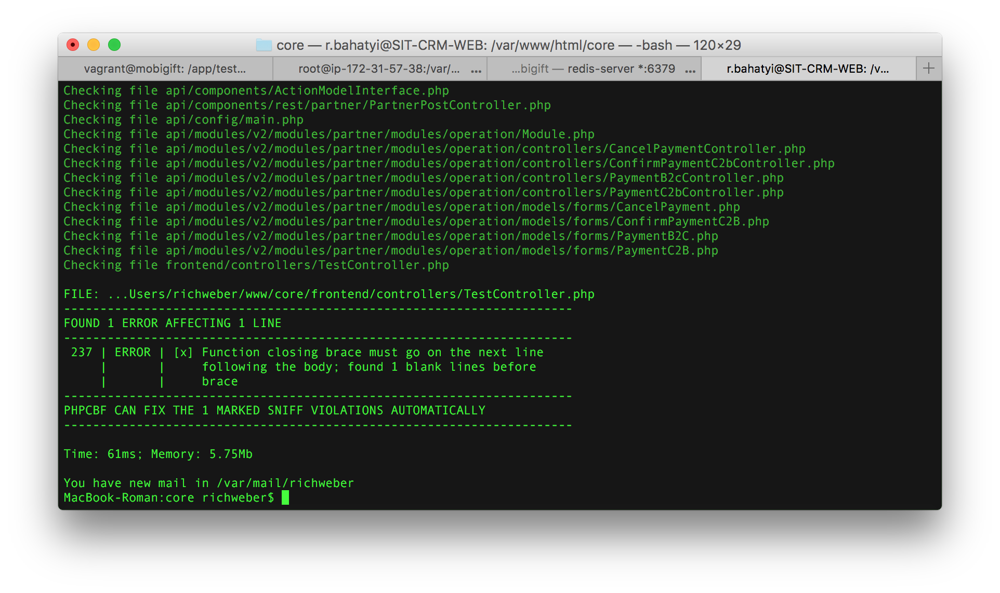

# Yii2 Code Sniffer Git Hook

You can read about Yii2 standard here: https://github.com/yiisoft/yii2/blob/master/docs/internals/core-code-style.md

## How to install

### Getting Yii2 code standard

```
$ git clone git://github.com/yiisoft/yii2-coding-standards.git
```

### Install composer

```
$ curl -sS https://getcomposer.org/installer | php
$ mv composer.phar /usr/local/bin/composer
```

### Install Code Sniffer

```
$ composer global require "squizlabs/php_codesniffer=*" 
```

### Install Yii2 code standard

```
$ cd yii2-coding-standards
$ cp -r Yii2 ~/.composer/vendor/squizlabs/php_codesniffer/CodeSniffer/Standards/Yii2
```

Check Yii2 standard

```
$ phpcs -i
```

Set Yii2 as coding standard by default:

```
$ phpcs --config-set default_standard Yii2
```

### Install Git hooks

```
$ git clone git@github.com:RichWeber/yii2-code-sniffer-git-hook.git
$ cp yii2-code-sniffer-git-hook/pre-commit /YOUR_PROJECT/.git/hooks/pre-commit
$ cp yii2-code-sniffer-git-hook/pre-commit /YOUR_PROJECT/.git/hooks/pre-commit_yii2cs
$ cp yii2-code-sniffer-git-hook/.hooks_ignore /YOUR_PROJECT/.hooks_ignore
```

### Check Git hooks

```
$ cd /YOUR_PROJECT
$ git commit
```


